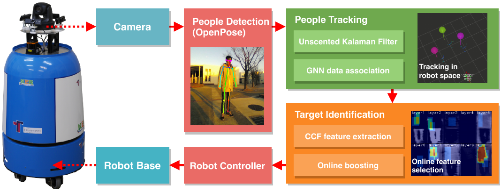

# monocular_person_following

This package provides a monocular vision-based person tracking and identification framework for person following robots. It first detects people using *tf-pose-estimation*, and then track them in the robot space with Unscented Kalman filter with the ground plane information. The combination of Convolutional Channel Features and Online Boosting runs on the top of the tracking module to keep tracking the target person with a re-identification capability. The entire system is designed so that it can be run on a Jetson TX2/Xavier, and it can easily be reproduced and reused on a new mobile robot platform.



[[video]](https://www.youtube.com/watch?v=w-f8l1VNT9Q)

[](https://www.codacy.com/app/koide3/monocular_person_following?utm_source=github.com&amp;utm_medium=referral&amp;utm_content=koide3/monocular_person_following&amp;utm_campaign=Badge_Grade) [](https://travis-ci.org/koide3/monocular_person_following) on kinetic & melodic

## Dependencies

- tf-pose-estimation
- monocular_people_tracking
- ccf_person_identification


## Install

### Install using system image

You can flush your TX2/Xavier with the following image file. It contains all the required packages.

- [[Jetxon TX2 (Jetpack 3.3)]](https://willbeavailable.soon)
- [[Jetxon Xavier (Jetpack 4.2)]](https://willbeavailable.soon)

### Install from source

We tested this package on TX2/Jetpack 3.3 and Xavier/Jetpack 4.2.

#### Maximize Processor speed

```bash
sudo su
echo 1 > /sys/devices/system/cpu/cpu1/online
echo 1 > /sys/devices/system/cpu/cpu2/online

~/jetson_clocks.sh
exit
```

#### Update system

```bash
sudo apt-get update
sudo apt-get upgrade
```

#### Flann

```bash
sudo apt-get install libflann-dev
```

#### OpenBLAS [Optional]

```bash
sudo apt install libopenblas-base libopenblas-dev
```

#### dlib

```bash
wget http://dlib.net/files/dlib-19.17.tar.bz2
tar xvf dlib-19.17.tar.bz2

echo "export DLIB_ROOT=/path/to/dlib" >> ~/.bashrc
source ~/.bashrc
```

#### tensorflow

```bash
sudo apt install python-pip
sudo pip install -U pip setuptools numpy
sudo pip install -U --extra-index-url https://developer.download.nvidia.com/compute/redist/jp33 tensorflow-gpu
```

#### ROS

See http://wiki.ros.org/kinetic/Installation/Ubuntu

!! Install tensorflow before ROS otherwise you see some dependency issues...

#### tf-pose-estimation

```bash
# llvmlite requires llvm >= 7.0
sudo apt-get install clang
wget http://releases.llvm.org/7.0.1/llvm-7.0.1.src.tar.xz
tar xvf tar xvf llvm-7.0.1.src.tar.xz
cd llvm-7.0.1.src && mkdir build && cd build
cmake -DCMAKE_BUILD_TYPE=Release -DLLVM_USE_LINKER=gold -DCMAKE_INSTALL_PREFIX=/usr/local ..
cmake -DCMAKE_CXX_COMPILER=clang++ -DCMAKE_C_COMPILER=clang -DCMAKE_BUILD_TYPE=Release -DLLVM_USE_LINKER=gold -DCMAKE_INSTALL_PREFIX=/usr/local ..
make -j6
sudo make install
```

```bash
cd catkin_ws/src
git clone https://github.com/koide3/tf-pose-estimation

# Follow the official installation instruction
cd tf-pose-estimation
sudo pip install -r requirements.txt

# In case you meet scipy install issue
# sudo apt-get install gfortran

cd tf_pose/pafprocess
swig -python -c++ pafprocess.i && python setup.py build_ext --inplace

cd ../..
sudo python setup.py install

# Sometimes you need to comment out python package dependencies in setup.py like as follows:
# 21: #   'dill==0.2.7.1',
```

#### other packages

```bash
cd catkin_ws/src
git clone https://github.com/koide3/open_face_recognition.git
git clone https://github.com/koide3/ccf_person_identification.git
git clone https://github.com/koide3/monocular_people_tracking.git --recursive
git clone https://github.com/koide3/monocular_person_following.git

sudo apt-get install ros-kinetic-image-transport ros-kinetic-image-transport-plugins ros-kinetic-image-proc
```


#### CSI camera driver [Optional]

```bash
cd catkin_ws/src
git clone https://github.com/peter-moran/jetson_csi_cam
git clone https://github.com/ros-drivers/gscam

sudo apt-get install gstreamer1.0-tools libgstreamer1.0-dev libgstreamer-plugins-base1.0-dev libgstreamer-plugins-good1.0-dev
```

In case images are flipped, modify "jetson_csi_cam.launch" as follows:

```bash
nvvidconv flip-method=0 ! video/x-raw, format=(string)BGRx ! videoconvert ! video/x-raw, format=(string)BGR" />
```

#### P3AT/DX robot driver [Optional]

```bash
cd catkin_ws/src
git clone https://github.com/amor-ros-pkg/rosaria.git
git clone http://github.com/reedhedges/AriaCoda

cd AriaCoda
sudo make install
cd /usr/local/Aria
make clean
make -j4

cd ~/catkin_ws
catkin_make -force_cmake
```


## Setup

### tf tree

Transformations between "odom" <-> "base_footprint" <--> "base_link" <--> "camera's frame" have to be defined.
[[example]](data/imgs/frames.png)

### camera calibration

Make sure that the intrinsic and extrinsic parameters of your camera have been calibrated. You have to be able to subscribe the intrinsic parameters from *camera_info* topic, and a proper transformation between "camera_frame" and "base_footprint" from tf.

## Start

In case you use Pioneer mobile base and Jetson TX2, you can use the following launch files.

```bash
roscd monocular_person_following/rviz
rviz -d monocular_person_following.rviz
```

```bash
# publish tf transformations and start pioneer
roslaunch monocular_person_following start_robot.launch
```

```bash
# start people detection/tracking/identification
roslaunch monocular_people_following jetson_person_following.launch
```

```bash
# start robot controller
rosrun monocular_person_following robot_controller.py cmd_vel:=/RosAria/cmd_vel
```


## Related packages

- [ccf_person_identification](https://github.com/koide3/ccf_person_identification)
- [monocular_people_tracking](https://github.com/koide3/monocular_people_tracking)
- [monocular_person_following](https://github.com/koide3/monocular_person_following)


## Papers
- Kenji Koide, Jun Miura, and Emanuele Menegatti, Monocular Person Tracking and Identification with Online Deep Feature Selection for Person Following Robots, Robotics and Autonomous Systems special issue on IAS-15. (under review)

- Kenji Koide and Jun Miura, Convolutional Channel Features-based Person Identification for Person Following Robots, 15th International Conference IAS-15, Baden-Baden, Germany, 2018 [[link]](https://www.researchgate.net/publication/325854919_Convolutional_Channel_Features-Based_Person_Identification_for_Person_Following_Robots_Proceedings_of_the_15th_International_Conference_IAS-15).